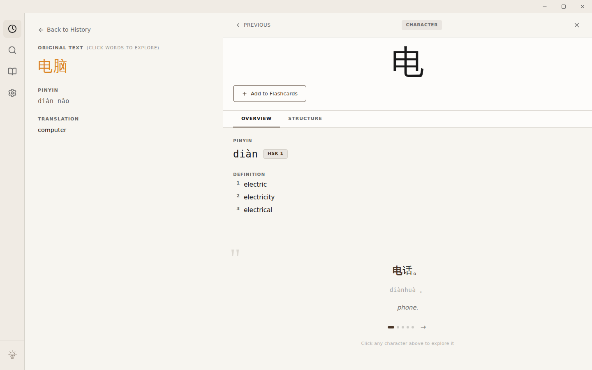
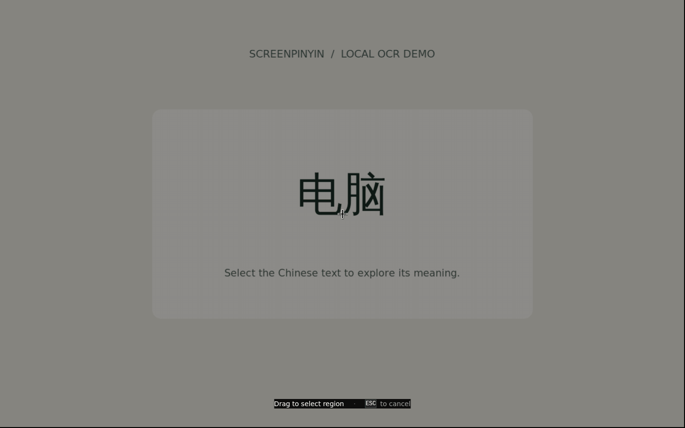

# ScreenPinyin Translator

A desktop app that captures Chinese text from your screen and shows pinyin and English meanings.

## Why

Read Chinese in an image, video or app without retyping it. Select a region of
your screen, look up the words, and save the ones you want to learn.

## How it works

1. Tesseract OCR reads the Chinese text in your selection.
2. jieba segments the text into words.
3. SQLite FTS5 searches CC-CEDICT for pinyin and definitions.
4. FSRS schedules flashcard reviews for words you save.



Pinyin for 电脑 (computer) and definitions for 电 (electricity).



Select a screen region, read the result, and open a character's definition.

## Setup

Use Node.js 22, npm 10 and Git. Native modules need
Python 3 and a C++ compiler: Visual Studio's C++ build tools on Windows,
Xcode Command Line Tools on macOS, or these packages on Debian/Ubuntu:

```sh
sudo apt-get install build-essential python3 libx11-dev libxtst-dev libpng-dev
```

Linux screen capture needs an X11 desktop, ImageMagick and `xrandr` (`sudo apt-get
install imagemagick x11-xserver-utils`). On macOS, allow Screen Recording and
Accessibility when prompted.

```sh
git clone https://github.com/EKarpinsky/screen-pinyin.git
cd screen-pinyin
npm ci
npm start
```

The first install compiles native modules and downloads dictionary data, so it
needs internet access and can take several minutes. The SQLite dictionary is
included in the checkout.

Use the capture shortcut below, drag a rectangle around Chinese text, and select
a result to see definitions or save a flashcard. The app can stay in the system
tray after you close its window; use the tray's Quit action to exit.

For startup and overlay issues, see [Troubleshooting](TROUBLESHOOTING.md).

### Optional Azure Translator

For full-text translation beyond the local dictionary, enter your Azure
Translator API key and region in **Settings**. The app saves them locally.
OCR, dictionary lookup, pinyin and flashcards work without an Azure key.

### Checks and packaging

```sh
npx tsc --noEmit
npm run lint
npm test
npm run package
```

`npm run test:watch` watches tests while you develop. `npm run package` creates an
unpacked app in `out/` for your platform. `npm run make` builds installers and
requires the platform's packaging tools.

On a Linux desktop, check the packaged app with:

```sh
node scripts/smoke-package.mjs "out/ScreenPinyin Translator-linux-x64/ScreenPinyin Translator"
```

The smoke check uses a temporary profile to test the renderer, preload, dictionary,
word segmentation and flashcard database.

## Hotkeys

| Shortcut | Action |
| --- | --- |
| Ctrl+Shift+C (Windows/Linux), Cmd+Shift+C (macOS) | Capture a screen region |
| Alt+P (Windows) | Look up selected text when the clipboard popup option is enabled in Settings |
| Escape | Cancel region selection, dismiss a popup/detail view, or leave flashcard review |
| Up / Down, Enter | Navigate dictionary search results and open a result |
| Space | Reveal the answer during flashcard review |
| 1 / 2 / 3 / 4 | Rate a revealed card Again / Hard / Good / Easy |

## Licenses

Application code: [MIT](LICENSE), copyright Eli Karpinsky.
Dictionary data: CC BY-SA 4.0. Tesseract `chi_sim.traineddata`: Apache 2.0.
See [NOTICE](NOTICE) for sources, contributors and data transformations.
